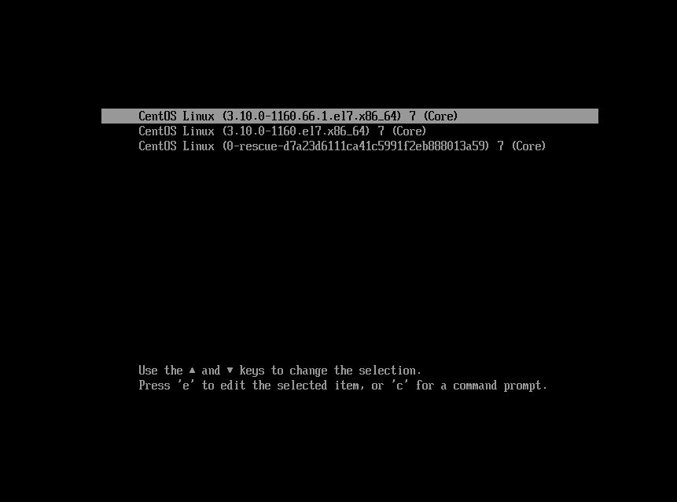
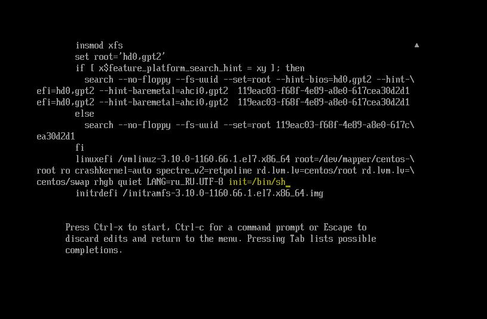
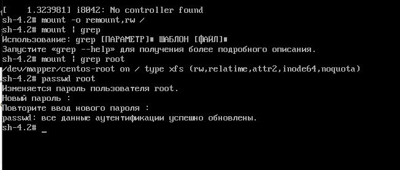
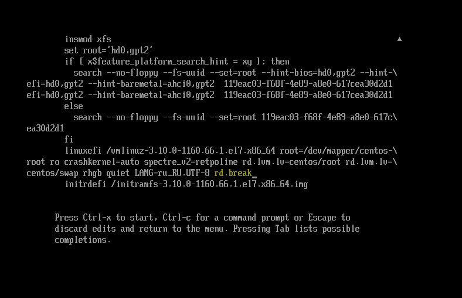
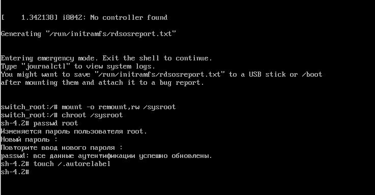
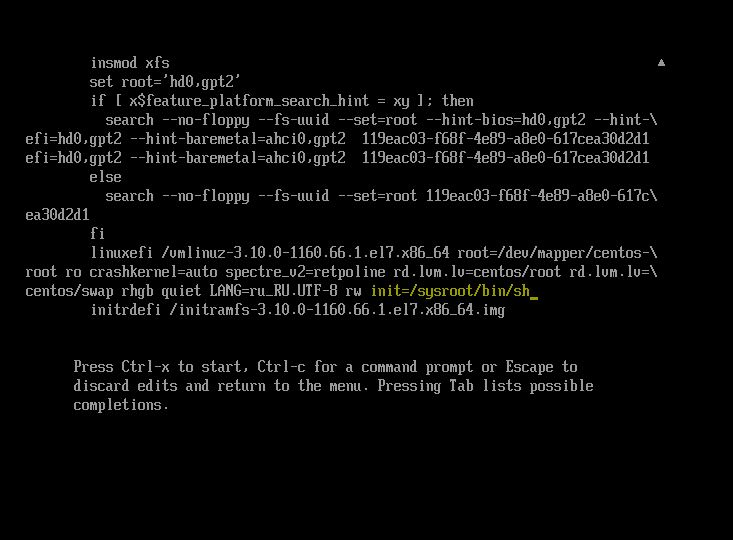
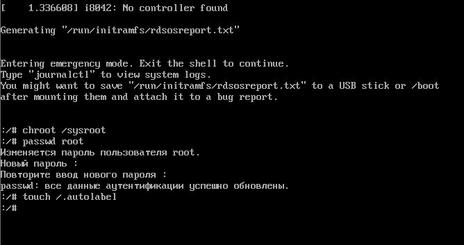
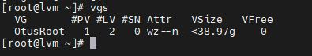
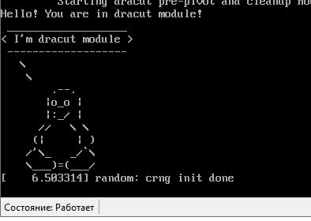

# # Домашнее задание "Работа с загрузчиком"

## Описание/Пошаговая инструкция выполнения домашнего задания:


1. Попасть в систему без пароля несколькими способами.
2. Установить систему с LVM, после чего переименовать VG.
3. Добавить модуль в initrd.

### Попасть в систему без пароля несколькими способами

#### Способ 1. init=/bin/sh


Запустить виртуальную машину и при выборе ядра длā загрузки нажать 'e'.  Попадаем в окно где изменяем параметры загрузки:



В конце строки начинающейся с linuxefi добавлāем init=/bin/sh и нажимаем сtrl-x для
загрузки в систему.



Перемонтирование рутовой файловой системы в режиме Read-Write.
```
mount -o remount,rw /
mount | grep root
```



Меняем пароль root

```
passwd root
```

#### Способ 2. rd.break

В конце строки начинающейся с linuxefi удаляем rhgb quiet добавляем rd.break enforcing=0 и нажимаем сtrl-x для
загрузки в систему



Попадаем в emergency mode. 
Попадаем в корневую файловую систему и меняем пароль администратора:
```
mount -o remount,rw /sysroot
chroot /sysroot
passwd root
touch /.autorelabel
```
После этого можно перезагружаться и заходить в систему с новым паролем. 
Полезно когда потеян или вообще не было известно пароль администратора.



#### Способ 3. rw init=/sysroot/bin/sh

В строке начинающейся с linuxefi заменяем ro на rw init=/sysroot/bin/sh и нажимаем сtrl-x для загрузки в систему:



В целом то же самое что и в прошлом примере, но файловаā система сразусмонтирована в режим Read-Write:

!

### Переименование VG

Переименование Volume Group:

```
vgrename VolGroup00 OtusRoot
```

Далее правим /etc/fstab, /etc/default/grub, /boot/grub2/grub.cfg. Везде заменяем старое название на новое.

```
sed -i 's/VolGroup00/OtusRoot/g' /etc/fstab
sed -i 's/VolGroup00/OtusRoot/g' /etc/default/grub
sed -i 's/VolGroup00/OtusRoot/g' /boot/grub2/grub.cfg
```

Пересоздаем initrd image, чтобы он знал новое название Volume Group

```
mkinitrd -f -v /boot/initramfs-$(uname -r).img $(uname -r)
```

Лог выполнеия выполнен командой scriptи находиться в файле grub.log




### Добавить модуль в initrd

Скрипты модулей хранятся в каталоге /usr/lib/dracut/modules.d/. Для того чтобы добавить свой модуль создаем там папку с именем 01test. 

```
mkdir /usr/lib/dracut/modules.d/01test
```
В нее поместим два скрипта:

Который устанавливает модуль 01test:
```
#!/bin/bash
check() {
    return 0
}
depends() {
    return 0
}
install() {
    inst_hook cleanup 00 "${moddir}/test.sh"
}
```

И Который вызывает скрипт модуля test.sh:
```
#!/bin/bash
exec 0<>/dev/console 1<>/dev/console 2<>/dev/console
cat <<'msgend'
Hello! You are in dracut module!
 ___________________
< I'm dracut module >
 -------------------
   \
    \
        .--.
       |o_o |
       |:_/ |
      //   \ \
     (|     | )
    /'\_   _/`\
    \___)=(___/
msgend
sleep 10
echo " continuing...."
```

Пересобираем образ initrd
```
mkinitrd -f -v /boot/initramfs-$(uname -r).img $(uname -r)
```
или
```
dracut -f -v
```

Можно проверить какие модули загружены в образ:
```
lsinitrd -m /boot/initramfs-$(uname -r).img | grep test
```

Убираем опции rghb и quiet в /boot/grub2/grub.cfg, чтобы увидеть вывод test.sh
Перегружаемся.

При перезагрузке видим результат работы модуля:

